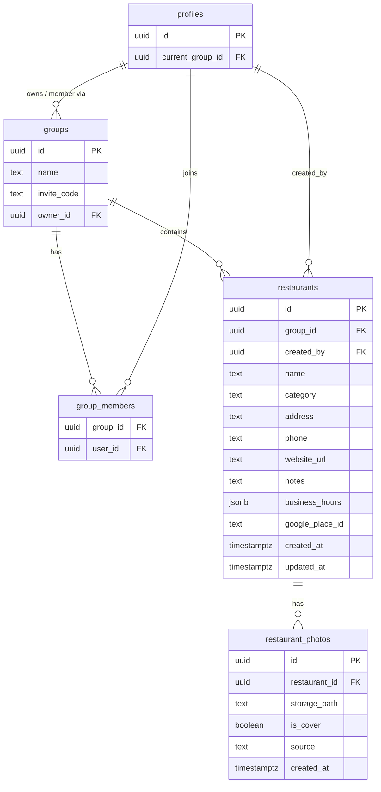

# DATABASE

**Product:** Yum Diary  
**Document type:** Database Schema Specification  
**Version:** 1.0  
**Last Updated:** 2026-07-12  
**Related:** `docs/PROJECT_SPEC.md`, `docs/FEATURES.md`

本文件定義 Yum Diary 的資料模型規格。  
**不包含 SQL Migration 實作細節**；實作時應以本文件為準，並與 Project Spec／Features 保持一致。

本文件僅涵蓋目前 MVP 已確定之餐廳與照片模型。不納入尚未定案的功能（例如 Menu Item 明細表、Diary／用餐紀錄表等）。

---

## 1. Database Principles

### 1.1 Restaurant 屬於 Group

- 每一筆餐廳必須隸屬一個 `group_id`。
- 餐廳的讀寫範圍以群組成員為界；個人收藏與共用清單皆透過 Group 表達。
- 群組刪除時，所屬餐廳（及關聯照片列）應一併清除，避免孤兒資料。

### 1.2 Database 只存 App Category

- `restaurants.category` **只允許** Yum Diary 固定分類字串。
- 合法值來自 `APP_CATEGORIES`（例如：早餐、小吃、飲料、日式、中式、韓式、南洋、西式、火鍋、甜點、其他）。
- **禁止**將 Google Places `primaryType`（如 `sushi_restaurant`）直接寫入資料庫。
- Google 類型僅在匯入當下經 Category Mapper 轉換後，再以 App Category 儲存。

### 1.3 Google Photo 只是 Preview

- Google 店家照片在新增流程中可作為**預覽／預設封面來源**。
- 正式持久化時，圖檔應下載（或使用者上傳）至 Storage；資料庫只存 `storage_path` 等中繼資料。
- 資料庫**不**把 Google photo resource name 當作最終資產路徑長期依賴。

### 1.4 Menu 永遠由使用者建立

- 菜單內容／菜單照片不由 Google Auto Fill 寫入。
- MVP 若以照片承載菜單，仍屬使用者上傳資產；來源標記應反映使用者建立，而非 Google。

### 1.5 Google 是輔助，手動建檔必須可行

- `google_place_id` 可為 `NULL`（純手動新增）。
- 有值表示曾對應 Google Place；同一群組內同一 Place 不應重複匯入。

---

## 2. restaurants Table

群組內餐廳主檔。一間店在一個群組中一筆列。

| Column | Type | Required | Description |
|--------|------|----------|-------------|
| `id` | `uuid` | Yes | 主鍵。建議由資料庫產生（如 `gen_random_uuid()`）。 |
| `group_id` | `uuid` | Yes | 所屬群組。FK → `groups.id`。建議 `ON DELETE CASCADE`。 |
| `created_by` | `uuid` | Yes | 建立者。FK → `profiles.id`。建議 `ON DELETE RESTRICT`（仍有餐廳時不可直接刪除 profile）。 |
| `name` | `text` | Yes | 店名。建議長度 1–100（trim 後）。 |
| `category` | `text` | Yes | App Category 字串（見原則 1.2）。建議長度 1–50；應用層驗證必須屬於固定清單。 |
| `address` | `text` | No | 地址。可為 `NULL`。 |
| `phone` | `text` | No | 電話。可為 `NULL`。 |
| `website_url` | `text` | No | 官方或相關網站 URL。可為 `NULL`。 |
| `notes` | `text` | No | 使用者備註。可為 `NULL`；建議上限約 200 字元（對齊新增表單）。永不由 Google Auto Fill 寫入。 |
| `business_hours` | `jsonb` | No | 營業時間結構（見第 3 節）。可為 `NULL` 表示未設定。 |
| `google_place_id` | `text` | No | Google Place ID。`NULL` = 手動新增；有值 = 來自／對應 Google。建議與 `group_id` 組成 UNIQUE（允許多筆 `NULL`）。 |
| `created_at` | `timestamptz` | Yes | 建立時間（UTC）。 |
| `updated_at` | `timestamptz` | Yes | 最後更新時間（UTC）；建議由 trigger 維護。 |

### 2.1 Constraints（建議）

- `UNIQUE (group_id, google_place_id)`：同一群組不重複匯入同一 Google Place；PostgreSQL UNIQUE 允許多筆 `NULL`。
- `category` 僅存 App Category；清單變更屬產品決策，不以獨立 category lookup table 為 MVP 必要條件。

### 2.2 Out of scope for this table (MVP)

以下欄位若已出現在歷史 migration，屬擴充／待對齊項目，**不**作為本規格 MVP 必填模型：`latitude`、`longitude`、`price_min`、`price_max`、`last_google_sync_at` 等。後續若納入，應另開規格修訂。

---

## 3. business_hours jsonb 格式

`restaurants.business_hours` 採用應用層約定之 JSON 結構，不以多表正規化營業時段。

### 3.1 Canonical shape

```json
{
  "periods": [
    {
      "open": "17:00",
      "close": "23:30"
    }
  ],
  "closedDays": ["日"]
}
```

| Field | Type | Description |
|-------|------|-------------|
| `periods` | `array` | 營業時段列表。可為空陣列或省略語意等價於「未設定時段」（實作應與表單約定一致）。 |
| `periods[].open` | `string` | 開始時間，24 小時制 `HH:mm`（如 `"09:00"`）。可為空字串表示未填。 |
| `periods[].close` | `string` | 結束時間，24 小時制 `HH:mm`。可為空字串表示未填。 |
| `closedDays` | `string[]` | 公休日。建議使用短標籤：`一`、`二`、`三`、`四`、`五`、`六`、`日`。 |

### 3.2 Rules

- **不**儲存時段顯示名稱（如「營業時段 1」「晚餐」）；UI 以列序呈現即可。
- 建議上限約 5 個 `periods`（對齊新增表單）。
- Google Auto Fill：有資料時寫入簡化後的 `periods` + `closedDays`；無資料時保持未設定／空白，不寫入假預設時間。
- `NULL` 整欄與「空 periods」之語意由應用層統一；儲存前應正規化，避免兩種空白狀態並存造成篩選困難。

---

## 4. restaurant_photos Table

餐廳照片中繼資料。圖檔本體存於 Supabase Storage；本表不存 binary。

| Column | Type | Required | Description |
|--------|------|----------|-------------|
| `id` | `uuid` | Yes | 照片列主鍵。 |
| `restaurant_id` | `uuid` | Yes | 所屬餐廳。FK → `restaurants.id`。建議 `ON DELETE CASCADE`。 |
| `storage_path` | `text` | Yes | Storage 物件路徑（bucket／object key），**非**完整公開 URL。 |
| `is_cover` | `boolean` | Yes | 是否為封面。預設 `false`。同一餐廳建議僅一張封面（可用應用層保證，或以 partial unique 強化）。 |
| `source` | `text` | Yes | 照片來源。建議枚舉語意：`user_upload`（使用者上傳）、`google`（由 Google 預覽入庫後標記）。用於區分資產來源；**不**取代 `storage_path`。 |
| `created_at` | `timestamptz` | Yes | 建立時間（UTC）。 |

### 4.1 Notes

- Google Preview 階段可只在前端顯示；確認儲存餐廳後，才下載並寫入本表與 Storage。
- 菜單照片若暫用本表承載，`source` 仍應為使用者建立；專用 Menu 表留待後續規格。
- 可選擴充（非 MVP 必填）：`caption`、`sort_order`。

---

## 5. Relationship Diagram



### 5.1 Cardinality summary

| Relationship | Cardinality |
|--------------|-------------|
| `groups` → `restaurants` | 1 : N |
| `profiles` → `restaurants`（created_by） | 1 : N |
| `restaurants` → `restaurant_photos` | 1 : N |
| `groups` ↔ `profiles`（via `group_members`） | N : M |

---

## 6. Suggested Indexes

除 PRIMARY KEY 與 FK／UNIQUE 自動產生之索引外，建議：

| Index | Table | Columns | Purpose |
|-------|-------|---------|---------|
| `restaurants_group_id_created_at_idx` | `restaurants` | `(group_id, created_at DESC)` | 群組內列表（最近新增）。 |
| `restaurants_group_id_category_idx` | `restaurants` | `(group_id, category)` | 分類篩選。 |
| `restaurants_group_id_name_idx` | `restaurants` | `(group_id, name)` | 店名搜尋／排序輔助（可視查詢模式調整為 trigram 等）。 |
| `restaurant_photos_restaurant_id_idx` | `restaurant_photos` | `(restaurant_id)` | 依餐廳載入照片（若 FK 未自動涵蓋查詢型態再補）。 |
| `restaurant_photos_restaurant_id_is_cover_idx` | `restaurant_photos` | `(restaurant_id, is_cover)` | 快速取封面；或改用 partial unique：`UNIQUE (restaurant_id) WHERE is_cover`。 |

`UNIQUE (group_id, google_place_id)` 已同時服務去重與查找。

---

## 7. RLS Design Principles

Yum Diary 使用 Supabase／Postgres RLS 時，應遵守下列原則（具體 policy SQL 不在本文件展開）。

### 7.1 Identity

- 以 `auth.uid()` 對應 `profiles.id`。
- 所有餐廳與照片存取必須先確認使用者為目標群組之成員（`group_members`）。

### 7.2 restaurants

| Operation | Principle |
|-----------|-----------|
| `SELECT` | 僅允許讀取使用者所屬群組的餐廳。 |
| `INSERT` | 僅允許寫入使用者所屬群組；`created_by` 必須等於 `auth.uid()`；`category` 由應用層保證為 App Category。 |
| `UPDATE` | 僅允許更新使用者所屬群組內的餐廳。 |
| `DELETE` | 僅允許刪除使用者所屬群組內的餐廳（是否限 owner 屬產品決策，預設建議群組成員可刪，或僅 owner／建立者——需在 Features 定案後補齊）。 |

### 7.3 restaurant_photos

| Operation | Principle |
|-----------|-----------|
| `SELECT` | 透過所屬 `restaurants.group_id` 驗證成員資格後可讀。 |
| `INSERT` / `UPDATE` / `DELETE` | 同上；不可對非成員群組的餐廳掛載照片。 |

### 7.4 Storage

- Storage bucket policy 應與 `storage_path` 所屬群組／餐廳一致，避免僅靠「知道 path」即可讀寫。
- Google 預覽圖在入庫前不應寫入受保護 bucket 作為最終資產，除非已完成下載與權限綁定。

### 7.5 Defense in depth

- RLS 為最後防線；應用層仍應以 `current_group_id`／成員檢查縮小查詢範圍。
- Service role key 僅用於受信任的伺服端工作，不得暴露於前端。

---

## Document notes

- 本文件欄位名稱與實際 Supabase／Postgres schema 一致（例如 `website_url`、`notes`）。
- 規格變更時同步更新 `FEATURES.md` 的 Related Database，並視需要修訂 `PROJECT_SPEC.md` 原則。
- Menu Item、Diary、收藏統計等表結構待產品定案後另開章節，不提前納入本文件。
