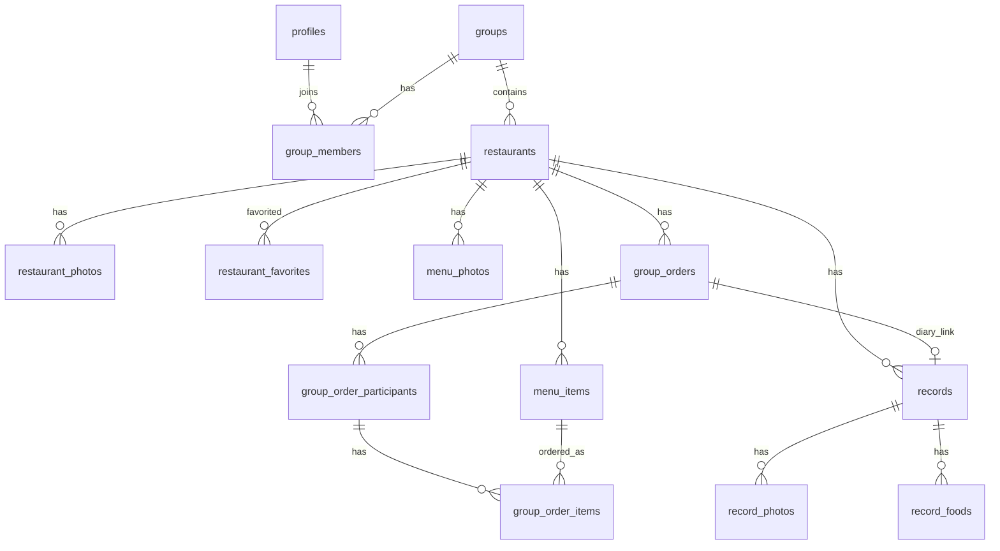

# DATABASE

**Product:** Yum Diary  
**Document type:** Database Schema Specification  
**Version:** 1.1  
**Last Updated:** 2026-08-03  
**Related:** `docs/PROJECT_SPEC.md`, `docs/FEATURES.md`, `supabase/migrations`（001–035）

本文件對齊目前 repo 的 schema（`src/types/database.ts` + migrations）。  
細節 SQL 以 migration 為準；產品原則以 Project Spec 為準。

---

## 1. Database Principles

### 1.1 Group-first

- Restaurant／Diary／Menu／Group Order 皆掛群組。
- 作用中群組：`profiles.current_group_id`。

### 1.2 App Category only

- `restaurants.category` 只存固定 App Category 字串。
- Google `primaryType` 不直接入庫。

### 1.3 Photos in Storage

- 資料庫僅存 path／中繼資料；實體在 Storage bucket `yum-diary`。
- Google 照片預覽後應下載入庫再持久化。

### 1.4 Menu is user-owned

- 不由 Google Auto Fill 寫入 menu。

### 1.5 Google is assist-only

- `google_place_id` 可為 `NULL`。
- Auto Geocoding 只寫 `latitude`／`longitude`，不得寫 `google_place_id`。

### 1.6 Soft archive

- `restaurants.archived_at`：`NULL` = 作用中；有時間戳 = 已封存。
- 一般列表預設排除封存；歷史入口仍可讀 Detail。

---

## 2. Core identity & groups

### 2.1 `profiles`

| Column | Type | Notes |
|--------|------|--------|
| `id` | uuid PK | = `auth.users.id` |
| `display_name` | text | |
| `avatar_url` | text null | |
| `current_group_id` | uuid null FK → groups | 作用中群組 |
| `created_at` / `updated_at` | timestamptz | |

### 2.2 `groups`

| Column | Type | Notes |
|--------|------|--------|
| `id` | uuid PK | |
| `name` | text | |
| `invite_code` | text | 邀請用 |
| `owner_id` | uuid FK → profiles | |
| `reference_latitude` / `reference_longitude` | float null | 預設位置（距離篩選／Decide） |
| `created_at` / `updated_at` | timestamptz | |

### 2.3 `group_members`

| Column | Type | Notes |
|--------|------|--------|
| `group_id` | uuid FK | PK 組合 |
| `user_id` | uuid FK | PK 組合 |
| `role` | text | 如 owner / member |
| `joined_at` | timestamptz | |

相關 RPC：`create_group`、`join_group`（invite）、`leave_group`、`delete_group` 等（見 migrations 006/020/022/023）。

---

## 3. `restaurants`

| Column | Type | Required | Description |
|--------|------|----------|-------------|
| `id` | uuid | Yes | PK |
| `group_id` | uuid | Yes | FK → groups |
| `created_by` | uuid | Yes | FK → profiles |
| `name` | text | Yes | |
| `category` | text | Yes | App Category |
| `phone` / `address` / `website_url` / `notes` | text | No | |
| `city` / `district` | text | No | `028`；地址解析 |
| `latitude` / `longitude` | float | No | 地圖／距離 |
| `price_min` / `price_max` | int | No | |
| `google_place_id` | text | No | UNIQUE with group_id；允許多 NULL |
| `google_photo_reference` | text | No | 預覽用 metadata |
| `google_rating` / `google_rating_count` | number | No | |
| `price_level` | int | No | |
| `business_hours` | jsonb | No | 見 §3.1 |
| `last_google_sync_at` | timestamptz | No | |
| `restaurant_cover_path` | text | No | Storage path（封面） |
| `archived_at` | timestamptz | No | `035`；軟封存 |
| `created_at` / `updated_at` | timestamptz | Yes | |

### 3.1 `business_hours` jsonb

```json
{
  "periods": [{ "open": "17:00", "close": "23:30" }],
  "closedDays": ["日"]
}
```

### 3.2 Related tables

**`restaurant_photos`**

| Column | Type | Notes |
|--------|------|--------|
| `id` | uuid | |
| `restaurant_id` | uuid | CASCADE |
| `storage_path` | text | |
| `caption` | text null | |
| `is_cover` | boolean | default false |
| `created_at` | timestamptz | |

（無 `source` 欄；舊文件有誤。）

**`restaurant_favorites`**

| Column | Type | Notes |
|--------|------|--------|
| `id` | uuid | |
| `restaurant_id` | uuid | |
| `user_id` | uuid | |
| `created_at` | timestamptz | |

---

## 4. Menu

### 4.1 `menu_photos`

| Column | Type | Notes |
|--------|------|--------|
| `id` | uuid | |
| `restaurant_id` | uuid | |
| `storage_path` | text | |
| `page` | int | 頁序 |
| `created_by` | uuid null | |
| `created_at` | timestamptz | |

### 4.2 `menu_items`

| Column | Type | Notes |
|--------|------|--------|
| `id` | uuid | |
| `restaurant_id` | uuid | |
| `category` | text | 菜單分類標籤 |
| `name` | text | |
| `price` | numeric null | |
| `display_order` | int | |
| `created_at` / `updated_at` | timestamptz | |

不含 description／加料選項（Foundation）。

---

## 5. Diary（records）

### 5.1 `records`

| Column | Type | Notes |
|--------|------|--------|
| `id` | uuid | |
| `restaurant_id` | uuid | |
| `user_id` | uuid | 作者 |
| `visit_date` | date / text | 造訪日 |
| `rating` | number | |
| `notes` | text | |
| `group_order_id` | uuid null | `034`；連結已完成點餐 |
| `created_at` / `updated_at` | timestamptz | |

列表查詢應 join restaurant 並過濾 `restaurants.group_id = current_group_id`。

### 5.2 `record_photos`

| Column | Type | Notes |
|--------|------|--------|
| `id` | uuid | |
| `record_id` | uuid | |
| `storage_path` | text | |
| `photo_order` | int | |
| `created_by` | uuid null | |
| `created_at` | timestamptz | |

### 5.3 `record_foods`

| Column | Type | Notes |
|--------|------|--------|
| `id` | uuid | |
| `record_id` | uuid | |
| `name` | text | |
| `display_order` | int | |

---

## 6. Group Order

### 6.1 `group_orders`

| Column | Type | Notes |
|--------|------|--------|
| `id` | uuid | |
| `group_id` | uuid | |
| `restaurant_id` | uuid | |
| `title` | text | |
| `description` | text null | UI 建立時可省略 |
| `status` | text | `OPEN` \| `CLOSED` \| `COMPLETED` |
| `close_at` | timestamptz | |
| `created_by` | uuid | Host |
| `completed_at` | timestamptz null | `033` |
| `created_at` / `updated_at` | timestamptz | |

### 6.2 `group_order_participants`

| Column | Type | Notes |
|--------|------|--------|
| `id` | uuid | |
| `group_order_id` | uuid | |
| `user_id` | uuid | |
| `joined_at` / `created_at` | timestamptz | |

### 6.3 `group_order_items`

| Column | Type | Notes |
|--------|------|--------|
| `id` | uuid | |
| `participant_id` | uuid | |
| `menu_item_id` | uuid | |
| `quantity` | int | |
| `note` | text null | |
| `created_at` / `updated_at` | timestamptz | |

---

## 7. Relationship Diagram



---

## 8. Storage

- Bucket：`yum-diary`（migration `011`）
- 建議 path：`restaurants/...`、`menus/...`、`records/...`
- 上傳：前端 `compressImage` → WebP；cacheControl `31536000`
- 開發者批次：`scripts/migratePhotoCompression.ts`（Service Role + sharp）

---

## 9. RLS Principles

- 身分：`auth.uid()` ↔ `profiles.id`
- Restaurant 相關讀寫：須為群組成員（`is_group_member`／`can_access_restaurant`）
- Record 有專屬 RLS（`021`）
- Group Order 沿用群組／餐廳可存取規則
- Service Role 僅可信腳本／伺服端

### Archive query convention（應用層）

- `listRestaurants` 預設：`archived_at IS NULL`
- `includeArchived: true`：Nearby 去重等特殊用途
- `listArchivedRestaurants`：僅已封存
- `getRestaurant`：封存仍可讀（歷史連結）

---

## 10. Migration index（主要）

| # | Topic |
|---|--------|
| 001–006 | base、profiles、trigger、groups、members、create_group |
| 007–009 | restaurants、photos、google_photo_reference |
| 010 | records |
| 011 | storage |
| 013–014 | menu_photos、google metadata |
| 015 / 025 | group reference location |
| 016–017 | RLS、cover path |
| 018–019 | record_photos、record_foods |
| 020–023 | invite join、record RLS、leave、delete group |
| 024 | favorites |
| 026 | menu_items |
| 027–031 / 033 | group orders、participants、items、completed_at |
| 028 | city / district |
| 034 | records.group_order_id |
| 035 | restaurants.archived_at |

---

## Document notes

- 欄位名稱以 snake_case 為準；TS 層 camelCase 僅為映射。
- 變更 schema 時同步本檔與 `FEATURES.md`。
